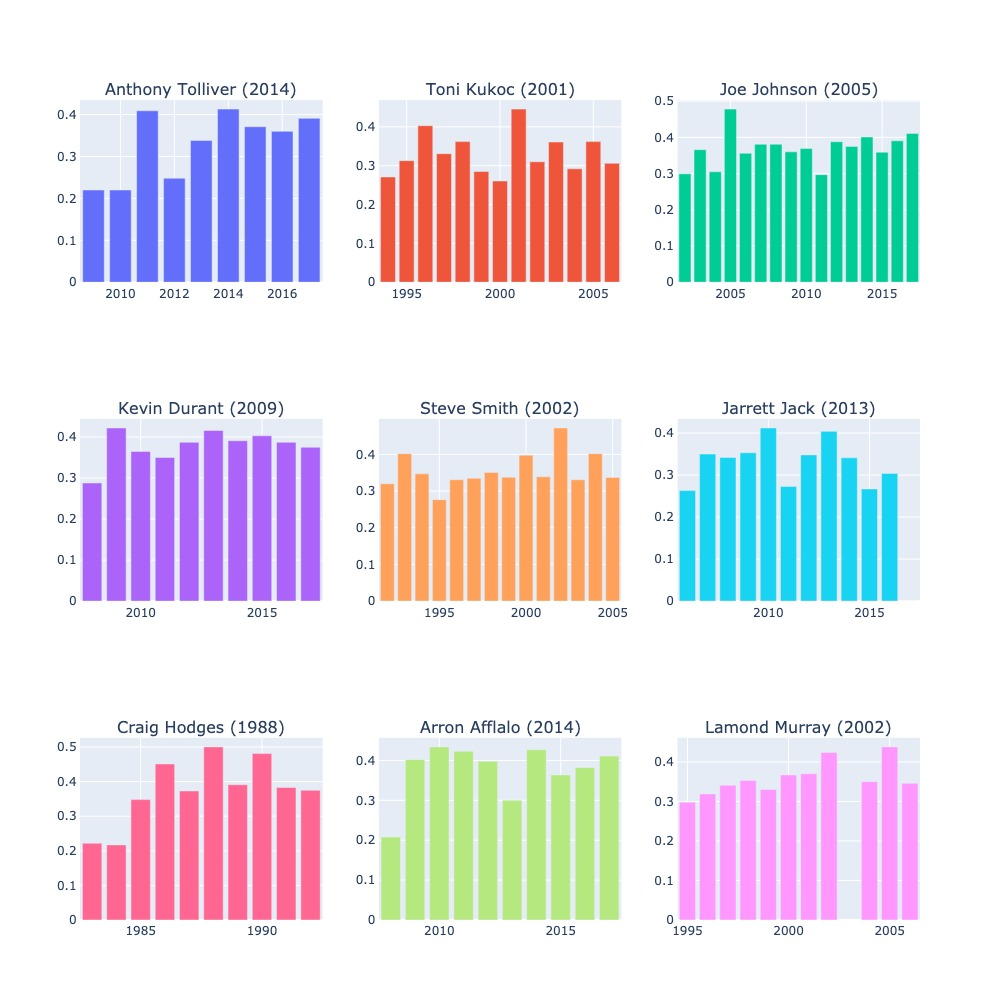
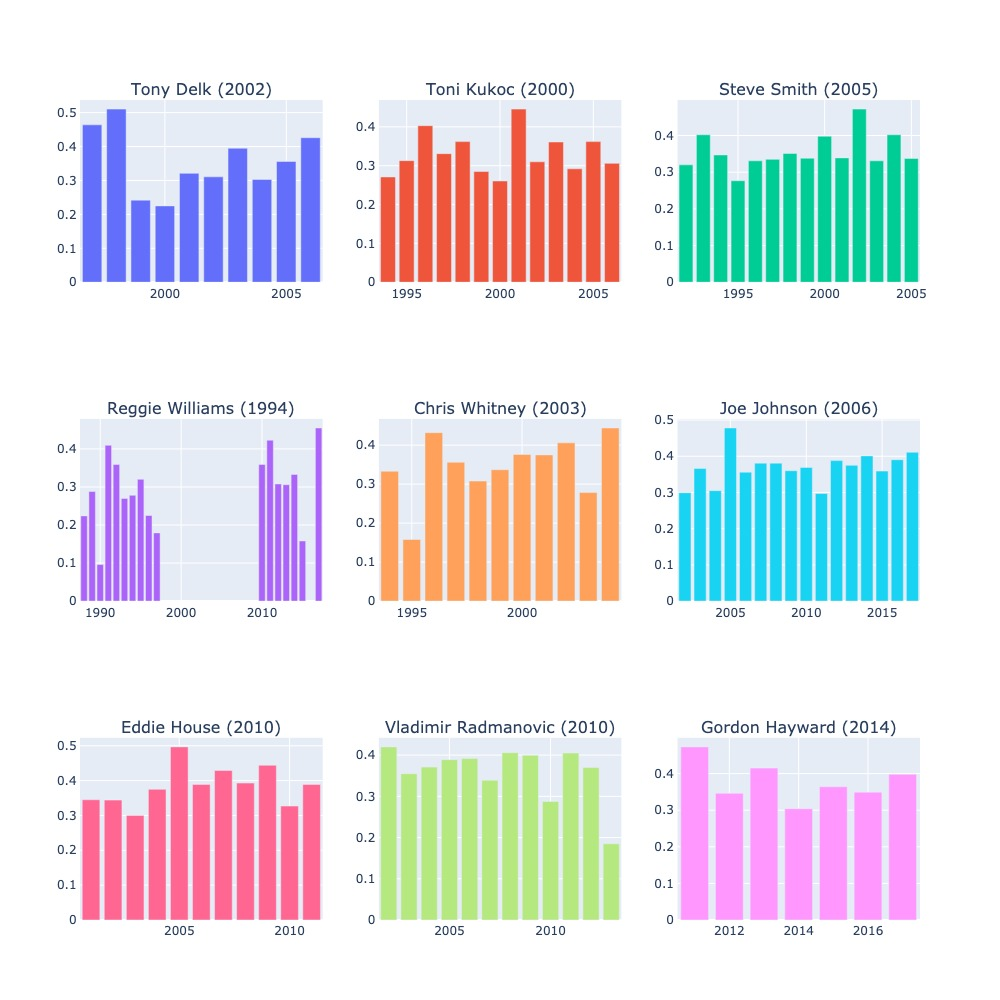

I am a big basketball fan and was always fascinated by the data that was generated for players, teams, seasons, etc. A friend and I thought it would be interesting to analyze 3-point data to see who had the largest single season increase (and decrease) in 3-point percentage. 

Below is a chart that highlights the top 9 players with a single season increase in 3-point percentage and the year of their single season increase in brackets. For example, Toni Kukoc experienced a whopping 18.5% increase in 3-point percentage from 2000 to 2001.

I was also curious to see who had the biggest decrease from one season to the next and the chart below shows exactly that - the top 9 players with the largest decrease from one season to the next. 

Below is the code used to generate the data and charts above:

